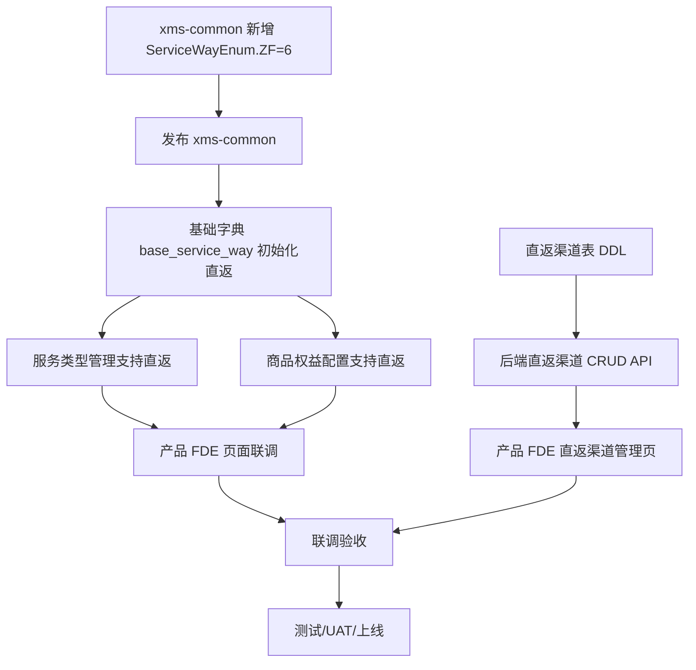
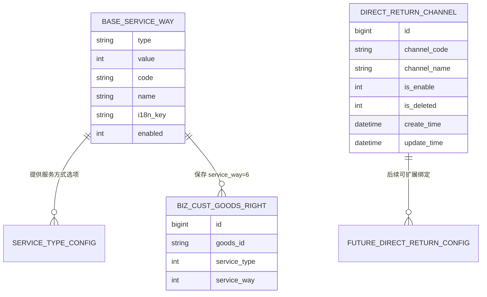
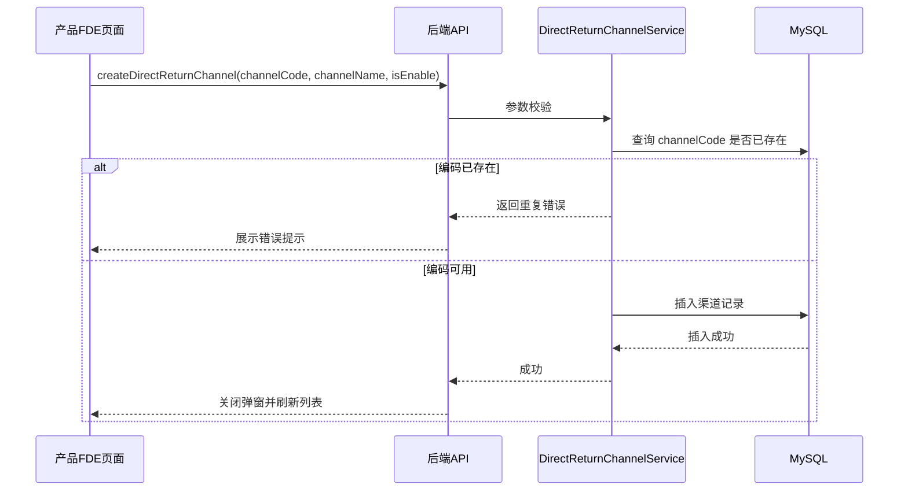
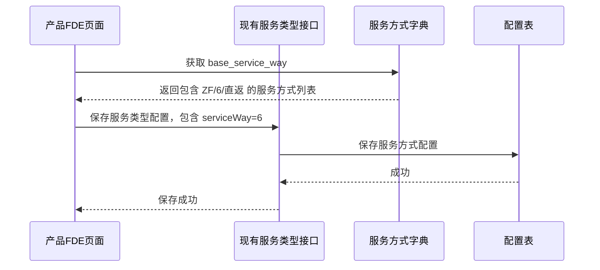

# B端直返服务方式支持技术方案

## 注意：

本文档按照《技术方案标准模板》重写，用于替换此前不够清晰的草稿版本。

本方案重点说明：

1. B端新增“直返”服务方式的整体技术方案。
2. 后端、数据、前端 FDE 的职责边界。
3. 产品/FDE 可直接理解和执行的页面改造清单、字段说明、验收标准。
4. 当前项目真实状态、阻塞项和推进顺序。

本文档不再把 FDE 交接写成独立技术黑话，而是放在“整体解决方案 / 接口设计 / 数据设计 / 时间线 / 决策”中，产品和 FDE 可以按页面和验收项直接执行。

# 修订版本：

| 版本 | 日期 | 作者 | 修订说明 |
| --- | --- | --- | --- |
| v1.0 | 2026-05 | 项目早期方案 | 初版方案，覆盖 F01/F02/F03，但评审后存在 P0/P1/P2 修改意见 |
| v1.1 | 2026-06-16 | Loop 整理 | 按标准模板重构；明确前端由产品 FDE 承接；补充发布顺序、接口边界、页面验收、风险和决策项 |

## 设计概要

### 背景

生态链/电商直供业务需要支持一种新的售后服务方式：**直返**。

现有 B 端政策和商品权益配置中，服务方式主要包含到家、到店、寄修、厂家售后、虚拟服务受理等。对于电商直供场景，部分商品或渠道需要走“直返”模式，即用户/渠道侧不再按传统寄修或到店流程处理，而是按业务约定直接返到指定渠道或逆向仓。

当前系统没有标准化的“直返”服务方式，导致：

1. B 端商品权益无法明确配置“直返”。
2. 服务类型管理页无法展示和维护“直返”能力。
3. 直返渠道缺少统一维护入口。
4. 后续工单、仓储、财务、库存链路无法基于统一的服务方式识别直返业务。

### 设计范围

本期范围分为三个功能点：

| 功能点 | 名称 | 范围 | 责任方 |
| --- | --- | --- | --- |
| F01 | 新增直返服务方式枚举 | `xms-common` 新增 `ServiceWayEnum.ZF(6, "直返")` 并发版 | 后端 |
| F02 | B端商品权益支持直返服务方式 | 服务类型管理页展示/编辑直返；商品权益配置可选择直返 | 后端 + 产品 FDE |
| F03 | 直返渠道管理 | 后端提供直返渠道 CRUD API 和 DDL；产品 FDE 实现管理页面 | 后端 + 产品 FDE |

本期不包含：

1. B 端政策四层体系重构。
2. 权益核销机制重构。
3. 额度并发控制。
4. 凑整能力。
5. 换货/退货等 `ServiceTypeEnum` 改造。
6. 直返渠道与客户、商品、组织的复杂绑定关系。

这些内容如需建设，应归入独立项目或后续迭代。

### 设计难点

| 难点 | 说明 | 处理方式 |
| --- | --- | --- |
| 公共枚举发版依赖 | `ServiceWayEnum` 位于 `xms-common`，下游依赖发版后才能稳定引用 | F01 优先合并和发版 |
| 前端历史实现不一致 | 现有服务类型页面使用 `way0 ~ way17` 固定字段，直返历史方案使用 `way18` | FDE 实现时优先按 `serviceWay=6/ZF` 识别，避免只依赖数组下标 |
| 技术方案评审未闭环 | 旧方案 v1.0 有 P0/P1/P2 修改意见 | 本文档作为 v1.1 重构方案，需要重新评审 |
| 直返渠道 DDL 外部依赖 | 新表需要 DBA 或有权限人员执行 | DDL 作为上线前置项单独跟踪 |
| E2E 测试缺失 | F03 评论中提示缺少 TeeGo 测试计划 | 产品/QA 需提供测试计划 URL 或明确手工验收方案 |

### 术语定义：

| 术语 | 定义 |
| --- | --- |
| 直返 | 新增服务方式，枚举建议为 `ZF`，ID 为 `6`，中文名“直返” |
| 服务方式 | 售后履约方式，如到家、到店、寄修、厂家售后、直返等，对应 `ServiceWayEnum` |
| 服务类型 | 售后业务类型，如换货、退货等，对应 `ServiceTypeEnum`，本期不新增服务类型 |
| B端商品权益 | B端商品在不同服务类型/服务方式下配置的权益规则 |
| 直返渠道 | 支持直返业务的渠道主数据，用于后续配置、查询和运营管理 |
| FDE | 产品侧前端开发，负责页面实现、交互、菜单权限和前端验收 |

## 架构设计/解决方案设计

### 整体解决方案

本期采用“公共枚举 + 字典配置 + 后端 API + 产品 FDE 页面”的方案。

#### 总体流程



#### 职责边界

| 模块 | 后端负责 | 产品/FDE 负责 |
| --- | --- | --- |
| 公共枚举 | 新增 `ServiceWayEnum.ZF=6`，发版 `xms-common` | 无 |
| 服务方式字典 | 初始化 `base_service_way` 的直返记录 | 确认页面展示文案 |
| 服务类型管理 | 确认现有接口可返回/保存直返服务方式 | 列表新增“直返”展示；编辑页支持勾选直返 |
| 商品权益配置 | 确认保存/查询链路支持 `serviceWay=6` | 确认新增、编辑、详情、导入、导出支持直返 |
| 直返渠道 | DDL、CRUD API、校验、接口文档 | 管理页面、菜单权限、前端校验、联调验收 |
| 测试 | 接口自测、联调支持 | 页面测试、E2E/手工测试、产品验收 |

### 架构和关系图



说明：

1. `base_service_way` 是服务方式字典来源。
2. `t_base_biz_cust_goods_right.service_way` 保存服务方式 ID，本期新增值为 `6`。
3. `t_base_biz_cust_direct_return_channel` 是直返渠道主数据，本期不强制与商品权益表建立外键或绑定关系。

### 系统触发条件

本期主要是配置型能力，触发条件如下：

| 触发方 | 触发动作 | 系统行为 |
| --- | --- | --- |
| 运营/配置人员 | 在服务类型管理页勾选“直返” | 保存服务类型支持的服务方式 |
| 运营/配置人员 | 在商品权益配置页选择“直返” | 保存商品权益的服务方式为 `6` |
| 运营/配置人员 | 在直返渠道管理页新增/编辑渠道 | 调用后端直返渠道 CRUD API |
| 售后业务系统 | 后续按服务方式读取权益 | 识别 `serviceWay=6` 为直返 |

## 接口设计 （对外提供的）

### 接口协议

本期接口分两类：

1. F02 复用现有服务类型和商品权益接口，不建议新增接口。
2. F03 新增直返渠道管理接口。

#### F02：服务类型/商品权益接口

F02 前端需要复用现有接口，重点确认以下能力：

| 能力 | 是否新增接口 | 说明 |
| --- | --- | --- |
| 获取服务方式字典 | 否 | 现有字典接口返回 `base_service_way`，需包含直返 |
| 服务类型列表 | 否 | 现有返回结构中 `serviceWayList` 应包含直返项 |
| 服务类型编辑保存 | 否 | 保存入参应允许直返服务方式 |
| 商品权益新增/编辑 | 否 | 服务方式选择中应允许 `serviceWay=6` |
| 商品权益详情 | 否 | 详情展示应能识别直返 |
| 商品权益导入/导出 | 视现状 | 若导入/导出包含服务方式中文文案，需要支持“直返” |

FDE 需要关注：如果现有页面把 `serviceWayList` 按数组下标展开成 `way0~way17`，直返不要只依赖“第 18 个位置”，应优先按 `value/id=6` 或 `code=ZF` 映射。

#### F03：直返渠道管理接口

接口命名以最终代码规范为准，建议能力如下：

| 接口 | 方法 | 说明 |
| --- | --- | --- |
| 分页查询直返渠道 | `pageDirectReturnChannel` | 支持按渠道编码、渠道名称、启用状态查询 |
| 新增直返渠道 | `createDirectReturnChannel` | 新增渠道，校验编码唯一 |
| 编辑直返渠道 | `updateDirectReturnChannel` | 编辑渠道信息，校验 ID 存在和编码唯一 |
| 启用/禁用渠道 | `switchDirectReturnChannel` | 修改启用状态 |
| 删除渠道 | `deleteDirectReturnChannel` | 逻辑删除 |
| 查询渠道详情 | `getDirectReturnChannel` | 可选，用于编辑回显 |

##### 分页查询

请求字段：

| 字段 | 类型 | 必填 | 说明 |
| --- | --- | --- | --- |
| channelCode | String | 否 | 渠道编码，支持模糊或精确由后端确认 |
| channelName | String | 否 | 渠道名称，支持模糊查询 |
| isEnable | Integer | 否 | 启用状态，1 启用，0 禁用 |
| pageNo | Integer | 是 | 页码 |
| pageSize | Integer | 是 | 每页条数 |

返回字段：

| 字段 | 类型 | 说明 |
| --- | --- | --- |
| id | Long | 主键 |
| channelCode | String | 渠道编码 |
| channelName | String | 渠道名称 |
| isEnable | Integer | 启用状态 |
| createTime | String | 创建时间 |
| updateTime | String | 更新时间 |

##### 新增/编辑

请求字段：

| 字段 | 类型 | 必填 | 说明 |
| --- | --- | --- | --- |
| id | Long | 编辑必填 | 新增不传 |
| channelCode | String | 是 | 渠道编码 |
| channelName | String | 是 | 渠道名称 |
| isEnable | Integer | 是 | 启用状态 |

校验规则：

1. `channelCode` 必填，建议长度 1~64。
2. `channelCode` 格式待产品确认，建议只允许英文、数字、下划线、中划线。
3. `channelCode` 全局唯一，逻辑删除记录是否参与唯一校验需后端确认。
4. `channelName` 必填，建议长度 1~128。
5. `isEnable` 只允许 `0/1`。

### 接受的消息队列

本期不新增 MQ 消费。

### 任务调度

本期不新增定时任务。

## 外部依赖（使用外部的）

### 依赖的外部服务

| 依赖 | 用途 | 风险 |
| --- | --- | --- |
| xms-common | 提供 `ServiceWayEnum.ZF` | 必须先合并并发版，否则下游引用不稳定 |
| 基础字典/配置服务 | 返回 `base_service_way` 字典项 | 需初始化直返数据 |
| 权限/菜单系统 | 提供直返渠道管理页面入口和按钮权限 | 需产品/FDE 确认权限标识 |
| DBA/数据库发布流程 | 执行直返渠道表 DDL | DDL 未执行会阻塞 F03 页面联调 |
| TeeGo/QA 测试平台 | E2E 或测试计划 | 当前 F03 缺测试计划 URL |

### 通过消息队列输出

本期不新增 MQ 输出。

## 内部设计

### 领域分解

#### F01：公共枚举领域

| 对象 | 职责 |
| --- | --- |
| `ServiceWayEnum` | 新增 `ZF(6, "直返")`，提供统一枚举语义 |

#### F02：商品权益/服务类型配置领域

| 对象 | 职责 |
| --- | --- |
| 服务方式字典 | 提供“直返”选项 |
| 服务类型配置 | 维护某服务类型支持哪些服务方式 |
| 商品权益配置 | 维护商品权益对应的服务方式 |
| 产品 FDE 页面 | 展示、选择、保存、回显“直返” |

#### F03：直返渠道领域

| 对象 | 职责 |
| --- | --- |
| `DirectReturnChannel` | 直返渠道主数据实体 |
| `DirectReturnChannelService` | 参数校验、唯一性校验、启停、逻辑删除 |
| `DirectReturnChannelMapper` | 数据库 CRUD |
| 产品 FDE 页面 | 渠道列表、查询、新增、编辑、启停、删除 |

### 类图/交互图/序列图/流程图 等

#### 直返渠道新增流程



#### 服务类型支持直返流程



### 高可用设计

本期为配置管理能力，不新增高并发链路。高可用策略沿用现有后台管理系统能力。

需要注意：

1. 直返渠道查询必须分页，禁止无分页全量查询。
2. 新增/编辑需要唯一性校验，避免重复渠道编码。
3. 删除采用逻辑删除，避免误删导致历史配置不可追溯。
4. 接口异常需返回清晰错误文案，便于 FDE 展示。

### 非功能特性设计

| 类型 | 要求 |
| --- | --- |
| 性能 | 直返渠道列表必须分页；常规查询 P95 建议小于 500ms |
| 兼容性 | 不影响已有服务方式；历史服务类型和商品权益配置可正常展示 |
| 可维护性 | 直返渠道逻辑独立成服务，不建议塞入过大的客户域服务中 |
| 可扩展性 | 后续如需渠道与客户/商品/组织绑定，可新增关联表，不改本期主数据表 |
| 安全性 | 页面入口和按钮操作受权限控制；删除/禁用需二次确认 |

## 数据设计

### 数据安全性

1. 直返渠道删除采用逻辑删除，不做物理删除。
2. 渠道编码唯一，避免一渠道多编码造成运营混乱。
3. 页面删除、禁用需要二次确认。
4. 如后续渠道参与工单流转，必须保留历史渠道数据，不可物理清理。

### 数据库和表设计

#### 服务方式字典

需新增 `base_service_way` 记录，实际字段以线上字典表结构为准。

建议语义：

| 字段 | 建议值 | 说明 |
| --- | --- | --- |
| type | `base_service_way` | 服务方式字典类型 |
| value/id | `6` | 对齐 `ServiceWayEnum.ZF` |
| code/name | `ZF` | 枚举名 |
| displayName/desc | `直返` | 中文展示 |
| i18nKey | `XmsCommon.ServiceWayEnum.ZF` | 国际化 key |
| enabled | `1` | 启用 |

#### 直返渠道表

表名：`t_base_biz_cust_direct_return_channel`

| 字段 | 类型建议 | 必填 | 说明 |
| --- | --- | --- | --- |
| id | BIGINT | 是 | 主键 |
| channel_code | VARCHAR(64) | 是 | 渠道编码，唯一 |
| channel_name | VARCHAR(128) | 是 | 渠道名称 |
| is_enable | TINYINT | 是 | 是否启用，1 启用，0 禁用 |
| is_deleted | TINYINT | 是 | 逻辑删除，0 正常，1 删除 |
| create_time | DATETIME | 是 | 创建时间 |
| update_time | DATETIME | 是 | 更新时间 |
| create_by | VARCHAR(64) | 否 | 创建人，按现有规范决定 |
| update_by | VARCHAR(64) | 否 | 更新人，按现有规范决定 |

索引建议：

```sql
UNIQUE KEY uk_channel_code (channel_code)
KEY idx_enable_deleted (is_enable, is_deleted)
```

说明：如果业务要求逻辑删除后允许复用相同 `channel_code`，唯一索引需要调整为 `(channel_code, is_deleted)`；该点需要产品和后端共同确认。

### 缓存设计

本期不强制新增缓存。

如直返渠道后续用于高频工单流转，可再评估增加本地缓存或分布式缓存；管理后台 CRUD 阶段暂不需要。

### 数据对接设计

本期不做外部数据对接。

需要产品/运营提供首批直返渠道数据，作为初始化数据或上线后人工录入。

## 部署/运维

推荐发布顺序：

1. 合并并发布 `xms-common`，提供 `ServiceWayEnum.ZF=6`。
2. 初始化 `base_service_way` 直返字典。
3. 执行 `t_base_biz_cust_direct_return_channel` DDL。
4. 发布后端服务，提供直返渠道 CRUD API。
5. 产品 FDE 发布前端页面。
6. 联调验证。
7. UAT/灰度/正式上线。

运维注意：

1. DDL 执行需记录环境和时间。
2. 字典初始化需覆盖测试、预发、生产环境。
3. 发布前确认下游服务依赖的 `xms-common` 版本。
4. 若前端提前上线但字典未初始化，页面不应报错，只是不展示直返。

## 高危元素

| 高危项 | 风险 | 规避措施 |
| --- | --- | --- |
| 公共包发版 | `xms-common` 未发版导致下游不能引用 `ZF` | F01 作为前置任务单独卡点 |
| DDL | 直返渠道表未建导致页面无法联调 | DDL 纳入上线 checklist |
| 旧 MR | FUZ-72 旧 MR `#1659` 可能包含无关变更 | 不直接合旧 MR，FDE 接手后重新确认实现 |
| 固定 `way18` | 依赖数组下标可能因服务方式排序变化失效 | 优先按 `serviceWay=6/ZF` 识别直返 |
| 权限配置 | 页面无权限或权限过大 | 产品/FDE 按现有权限体系确认菜单和按钮权限 |

## 影响范围

| 系统/模块 | 影响 |
| --- | --- |
| `xms-common` | 新增服务方式枚举 |
| `asp-operation-service` | 新增或复用直返渠道后端能力；确认商品权益服务方式兼容性 |
| `asp-operation-web` | 服务类型管理、商品权益配置、直返渠道管理页面 |
| 基础字典 | 新增 `base_service_way=直返` |
| 数据库 | 新增直返渠道表 |
| QA/FDE | 新增页面和联调验收范围 |

不影响范围：

1. 不改变已有服务方式 ID。
2. 不改变已有商品权益数据。
3. 不改变 `ServiceTypeEnum`。
4. 不改变 B端政策重构相关能力。

## 可观测性

后台配置类功能主要依赖操作日志、接口日志和异常日志。

建议：

1. 直返渠道新增/编辑/删除/启停记录操作日志。
2. 渠道编码重复、参数非法返回明确错误码和错误文案。
3. DDL 和字典初始化在发布记录中留痕。
4. 联调时记录关键接口请求样例和响应样例。

## 风险评估

| 风险 | 等级 | 说明 | 应对 |
| --- | --- | --- | --- |
| `xms-common` MR 未合并/未发版 | 高 | 阻塞正式枚举引用 | 推动 Maintainer 合并 MR #1950 并发版 |
| 技术方案评审未闭环 | 高 | v1.0 曾有 P0/P1/P2 意见 | 本 v1.1 重新提交评审 |
| FDE 交接不清 | 中 | 前端由产品 FDE 承接，若交接不清会反复返工 | 本文按页面、字段、接口、验收标准交接 |
| 直返渠道 DDL 未执行 | 中 | F03 页面无法联调 | DDL 纳入上线前置项 |
| E2E 测试缺失 | 中 | 无法自动验收前后端流程 | 产品/QA 提供 TeeGo 测试计划或明确手工测试 |
| `way18` 下标不稳定 | 中 | 服务方式排序变化可能导致显示错误 | FDE 按 `serviceWay=6/ZF` 判断 |

## 时间线

建议时间线按“阻塞解除后”重新排期：

| 阶段 | 事项 | 责任方 | 前置条件 |
| --- | --- | --- | --- |
| T0 | v1.1 技术方案评审 | 后端/产品/FDE/QA | 本文档确认 |
| T1 | 合并并发版 `xms-common` | 后端/Maintainer | MR #1950 通过 |
| T2 | 字典和 DDL 准备 | 后端/DBA/运营 | 字段和初始数据确认 |
| T3 | 后端 API 确认/补齐 | 后端 | DDL 确认 |
| T4 | 前端 FDE 开发 | 产品 FDE | 接口文档和页面说明确认 |
| T5 | 联调 | 后端 + FDE | 后端/前端测试环境可用 |
| T6 | QA/UAT | QA/产品 | 测试计划准备完成 |
| T7 | 上线 | 项目组 | 验收通过 |

## XX需求决策

以下决策需要明确记录：

| 决策项 | 建议结论 | 状态 |
| --- | --- | --- |
| 是否新增服务方式枚举 | 是，新增 `ServiceWayEnum.ZF(6, "直返")` | 待 F01 合并发版 |
| 是否新增服务类型 | 否，不改 `ServiceTypeEnum` | 建议确认 |
| 前端是否由产品 FDE 承接 | 是，FDE 负责页面开发和验收 | 用户已明确 |
| F02 是否复用旧前端分支 | 不默认复用，仅作为参考 | 待产品/FDE 确认 |
| F03 前端是否复用旧分支 | 不默认复用，FDE 可参考 | 待产品/FDE 确认 |
| 直返渠道是否绑定客户/商品/组织 | 本期不做绑定，仅维护渠道主数据 | 待产品确认 |
| `channel_code` 格式 | 建议英文/数字/下划线/中划线 | 待产品确认 |
| 逻辑删除后编码是否允许复用 | 建议不复用，避免历史歧义 | 待后端/产品确认 |

## 其他参考文档：

1. BRD：`https://mi.feishu.cn/wiki/DYh9wRto6ijvCZkrYL2c0XJknmf`
2. 工单需求方案：`https://mi.feishu.cn/docx/OlDhdCGD9oA7vhx64gwcQYXzn3f`
3. 标准模板：`https://mi.feishu.cn/wiki/Wf2gw6EVsiija9k5AUqcKt8CntX`
4. Multica 项目：`B政策新增直返服务方式`
5. FUZ-355：`【B端直返 v2】直返服务方式全栈支持（八阶段流程）`
6. FUZ-71：`[F01] xms-common 新增直返枚举值`
7. FUZ-72：`[F02] 商品权益支持直返服务方式`
8. FUZ-73：`[F03] 直返渠道管理 — 新建表+全栈CRUD`
9. FUZ-74：`[F00] 编写技术方案文档`

## 评审记录

| 日期 | 评审人 | 结论 | 待处理问题 |
| --- | --- | --- | --- |
| 2026-06-01 | 早期评审 | Request Changes | 旧 v1.0 方案存在 4 个 P0、3 个 P1、4 个 P2，需整理并逐项回应 |
| 2026-06-16 | Loop 重构 | 待评审 | 按标准模板重写；明确 FDE 承接前端；待产品/后端/FDE/QA 评审 |

# 附录：给产品/FDE 的页面开发说明

> 这一节给产品和 FDE 看，不要求理解后端代码，只要按页面、字段、接口和验收标准执行。

## A1. FDE 需要做哪几个页面？

| 页面 | 要做什么 | 说明 |
| --- | --- | --- |
| 服务类型管理页 | 增加“直返”配置能力 | 列表能看到直返是否启用；编辑时能勾选直返 |
| 商品权益配置页 | 确认能选择和展示“直返” | 如果页面已动态渲染服务方式，重点做回归；如不能展示则补页面逻辑 |
| 直返渠道管理页 | 新增一个管理页面 | 支持查询、新增、编辑、启用/禁用、删除直返渠道 |
| 菜单/权限 | 增加入口和按钮权限 | 菜单名建议“直返渠道管理” |

## A2. 服务类型管理页怎么验收？

| 场景 | 操作 | 预期 |
| --- | --- | --- |
| 列表展示 | 打开服务类型管理页 | 能看到“直返”列 |
| 编辑保存 | 编辑一个服务类型，勾选直返并保存 | 保存成功 |
| 回显 | 再次打开编辑页 | 直返保持已勾选 |
| 取消勾选 | 取消直返并保存 | 列表和编辑页都显示未启用 |
| 兼容性 | 查看已有服务类型 | 原有服务方式展示不受影响 |

## A3. 商品权益配置页怎么验收？

| 场景 | 操作 | 预期 |
| --- | --- | --- |
| 新增权益 | 选择服务方式“直返”并保存 | 保存成功 |
| 编辑权益 | 修改服务方式为直返或取消直返 | 保存和回显正确 |
| 详情页 | 查看权益详情 | 展示“直返”文案 |
| 导入 | 导入包含“直返”的数据 | 能正确识别为直返 |
| 导出 | 导出包含直返的数据 | 导出文案为“直返” |

## A4. 直返渠道管理页怎么做？

### 查询条件

| 字段 | 控件 | 说明 |
| --- | --- | --- |
| 渠道编码 | 输入框 | 支持按编码查询 |
| 渠道名称 | 输入框 | 支持按名称查询 |
| 启用状态 | 下拉框 | 全部/启用/禁用 |

### 列表字段

| 字段 | 展示文案 |
| --- | --- |
| channelCode | 渠道编码 |
| channelName | 渠道名称 |
| isEnable | 启用状态 |
| createTime | 创建时间 |
| updateTime | 更新时间 |
| 操作 | 编辑、启用/禁用、删除 |

### 新增/编辑弹窗

| 字段 | 是否必填 | 规则 |
| --- | --- | --- |
| 渠道编码 | 是 | 建议 1~64 位；格式待产品确认 |
| 渠道名称 | 是 | 建议 1~128 位 |
| 启用状态 | 是 | 默认启用 |

### 页面交互要求

1. 新增成功后关闭弹窗并刷新列表。
2. 编辑成功后关闭弹窗并刷新列表。
3. 删除前必须弹确认框。
4. 禁用前建议弹确认框。
5. 渠道编码重复时展示后端错误提示。

## A5. FDE 不需要关心什么？

FDE 不需要处理：

1. `xms-common` 发版。
2. 数据库建表。
3. 后端接口实现。
4. 字典初始化 SQL。
5. 服务方式枚举 ID 分配。

这些由后端/DBA/项目负责人处理。FDE 只需要基于接口和页面说明完成前端页面、联调和验收。

## A6. FDE 最重要的注意事项

不要只按 `way18` 数组下标判断直返。

推荐优先按以下信息识别直返：

1. `serviceWay=6`
2. `code=ZF`
3. `name/desc=直返`

原因：`way18` 是历史页面里的展开字段，可能受服务方式列表排序影响。真正稳定的业务含义是 `ServiceWayEnum.ZF=6`。
