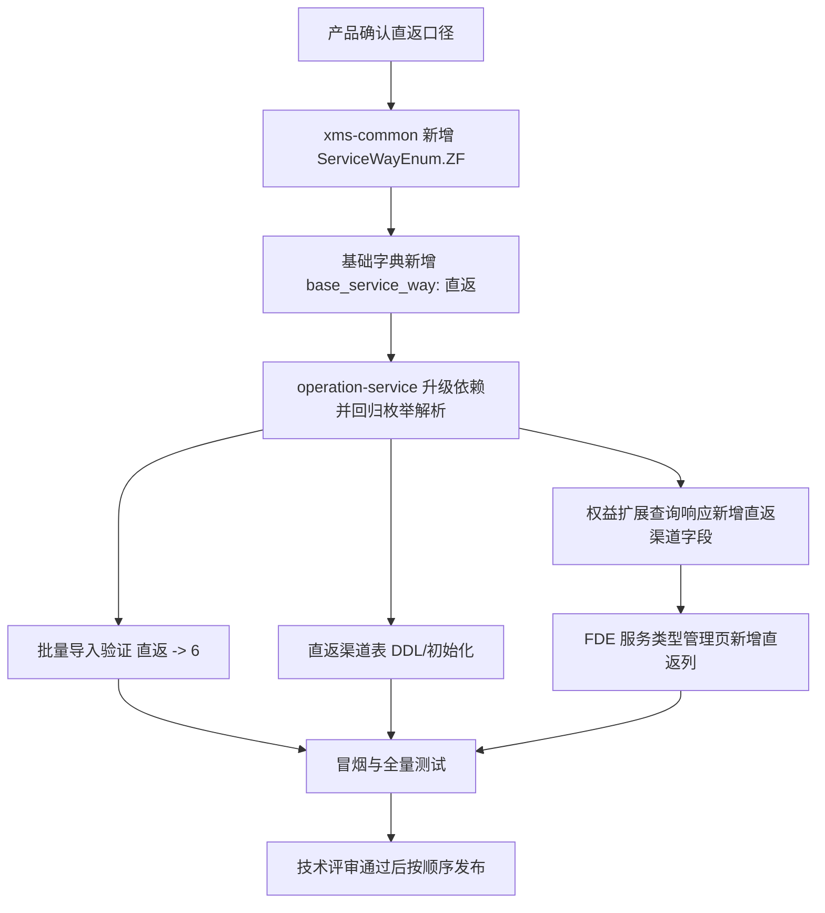
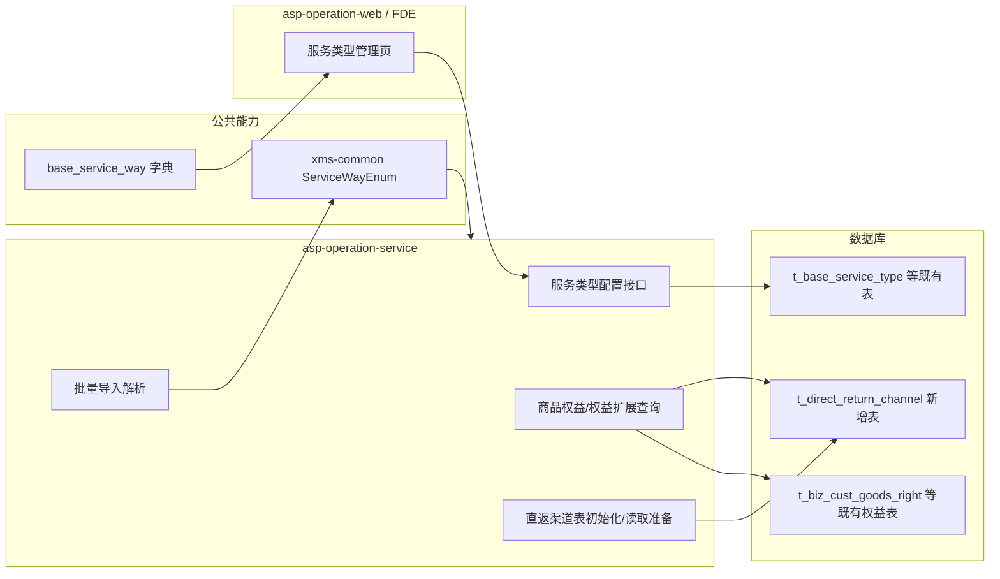

# B端直返服务方式支持技术设计方案

## 注意

本文档用于说明“B政策新增直返服务方式”项目的技术设计方案，按照《MIT 技术设计方案（架构+详细）标准&模版 V1.15》进行填充。

本文档以 2026-06-12 会议纪要为最新范围基准：本期目标是在 B 端售后政策/权益配置体系中新增“直返”服务方式，完成后端枚举、字典、直返渠道表初始化能力、权益扩展查询字段和批量导入映射验证；前端/FDE 范围仅为服务类型管理页面新增“直返”枚举列。

本文档不覆盖 B 端政策重构、工单履约流转、逆向仓收货、换新单生成、库存财务改造，也不在本期交付直返渠道管理页面或直返渠道增删改查接口。

# 修订版本

| 时间 | 版本号 | 修改内容 | 评审状态 | 修改人 |
| --- | --- | --- | --- | --- |
| 2026-06-16 | V1.2 | 按 2026-06-12 会议纪要纠偏范围：删除直返渠道 CRUD/API/页面交付；明确 FDE 仅服务类型管理页加“直返”列；补充权益扩展查询字段、建表初始化、批量导入映射验证和风险控制 | 待评审 | Loop 整理 |
| 2026-06-16 | V1.1 | 按 MIT 标准模板逐项填充；明确前后端分工、接口、数据、部署、风险和验收内容 | 待评审 | Loop 整理 |
| 2026-05 | V1.0 | 初版方案，覆盖直返枚举、商品权益支持和直返渠道能力讨论 | Request Changes | 项目早期方案 |

## 设计概要

### 背景

#### 系统简介

B 端售后政策/权益配置系统用于维护 B 端客户、商品、服务类型、服务方式和售后权益之间的配置关系。运营或配置人员通过后台页面维护服务类型、商品权益和政策数据，后续售后工单、履约识别、逆向处理和财务库存处理会基于这些配置识别可用服务方式。

当前系统已有服务方式包括到家、到店、寄修、厂家售后、虚拟服务受理等，但缺少“直返”服务方式。生态链/电商直供业务需要在 B 端政策能力中表达“直返”，以便后续履约链路能识别该服务方式并按业务规则处理。

#### 需求来源

需求来源于以下资料和沟通结论：

| 类型 | 链接/资料 | 本方案采用方式 |
| --- | --- | --- |
| BRD | 电商直供 - 生态链直返项目 BRD | 作为业务背景和后续链路方向参考 |
| 需求文档 | 直返服务方式支持 - 需求文档 | 作为功能需求来源 |
| 标准模板 | MIT 技术设计方案（架构+详细）标准&模版 V1.15 | 作为本文档结构依据 |
| 会议纪要 | 2026-06-12 张从越视频会议纪要 | 作为本期交付范围最终口径 |

#### 业务要解决的问题

1. B 端服务方式枚举缺少“直返”，商品权益和服务类型配置无法表达直返服务方式。
2. 服务类型管理页无法配置某个服务类型是否支持“直返”。
3. 权益扩展查询接口需要补充直返渠道字段，为后续链路识别直返渠道做准备。
4. 直返渠道需要有数据库表结构和初始化能力，但本期不交付运营维护页面和增删改查接口。
5. 批量导入链路需要确认“直返”中文枚举能正确解析到服务方式 ID，避免导入失败或写入错误服务方式。

#### 业务目标

| 目标 | 说明 |
| --- | --- |
| 统一直返标识 | 在公共枚举和基础字典中新增 `ZF / 直返`，服务方式 ID 固定为 `6` |
| 支持后台配置 | 服务类型管理页可展示和配置“直返”服务方式 |
| 支持权益查询 | 权益扩展查询接口返回直返渠道字段，满足后续链路读取需要 |
| 数据结构就绪 | 新增直返渠道表，完成表结构和必要初始化数据准备 |
| 导入链路兼容 | 批量导入可识别“直返”文案并映射为服务方式枚举 |

#### 上游依赖

| 上游 | 依赖内容 | 本项目要求 |
| --- | --- | --- |
| 产品/业务 | 明确直返服务方式口径、是否有首批直返渠道、字段展示口径 | 技术评审前确认，联调前冻结 |
| `xms-common` | 提供 `ServiceWayEnum.ZF(6, "直返")` | 需先合并、发版，再升级业务服务依赖 |
| 基础字典 | `base_service_way` 增加“直返”字典项 | 测试/生产环境上线前完成数据初始化 |
| DBA/数据库发布流程 | 新增直返渠道表 DDL | 后端联调前完成测试环境 DDL，生产按发布流程执行 |
| FDE/产品侧前端 | 服务类型管理页新增“直返”枚举列 | 后端字典和接口就绪后半天完成 |
| 测试负责人 | 冒烟和全量用例确认 | 提测前确认测试接口人和覆盖范围 |

#### 下游依赖

| 下游 | 可能影响 | 应对方式 |
| --- | --- | --- |
| 商品权益配置查询链路 | 需要识别 `serviceWay=6` | 复用现有枚举转换机制，新增枚举后回归 |
| 服务类型管理页 | 需要展示和保存“直返”列 | FDE 基于后端字典动态/半动态映射新增列 |
| 批量导入 | 需要识别“直返”中文值 | 后端验证导入枚举映射，必要时补充映射配置 |
| 售后工单/履约链路 | 后续可能按直返做流程分支 | 本期只提供统一标识和字段，不改造流程 |
| 逆向仓/库存/财务 | 后续可能依赖直返渠道 | 本期仅准备渠道表和查询字段，不做库存财务改造 |

### 设计目标

#### 功能目标

| 编号 | 目标 | 验收口径 |
| --- | --- | --- |
| G01 | 公共枚举新增直返 | `ServiceWayEnum.getById(6)` 返回 `ZF/直返`，老枚举不变 |
| G02 | 基础字典新增直返 | `base_service_way` 可返回“直返”选项，服务类型页面可消费 |
| G03 | 服务类型页面支持直返 | 页面列表出现“直返”列，编辑时可选择并保存回显 |
| G04 | 权益扩展查询补充直返渠道字段 | 查询接口响应包含直返渠道字段，老调用方兼容 |
| G05 | 直返渠道表完成初始化 | 测试/生产库具备直返渠道表结构，必要种子数据可初始化 |
| G06 | 批量导入映射可识别直返 | 导入包含“直返”的数据可正确解析为服务方式 `6` |

#### 非功能目标

| 类型 | 要求 |
| --- | --- |
| 兼容性 | 不改变已有服务方式 ID、名称和历史数据含义；老调用方缺省忽略新增字段不报错 |
| 可发布性 | 优先公共包和数据库准备，再发布后端服务，最后由 FDE 联调页面 |
| 可回滚性 | 枚举新增不回收 ID；服务发布可回滚；字典项可禁用或下线展示；DDL 按 DBA 回滚策略执行 |
| 可观测性 | 接口异常、导入失败、枚举解析失败可通过日志和接口错误码定位 |
| 安全性 | 不新增敏感信息；不绕过现有权限体系；直返渠道表仅保存业务主数据 |
| 性能 | 枚举和字典扩展为低频配置类操作，不引入高频查询压力 |

### 设计范围

#### 本期包含

| 功能点 | 功能名称 | 交付内容 | 负责人/协作方 |
| --- | --- | --- | --- |
| F01 | 新增直返服务方式枚举 | `xms-common` 新增 `ServiceWayEnum.ZF(6, "直返")`，保持老枚举兼容 | 后端 |
| F02 | 基础字典新增直返 | `base_service_way` 初始化直返字典项，页面可获取 | 后端/数据初始化 |
| F03 | 服务类型管理页支持直返 | FDE 在服务类型管理页新增“直返”列和编辑选项，无新增接口 | 产品 FDE |
| F04 | 权益扩展查询新增直返渠道字段 | 在权益扩展查询响应 DTO/BO/SQL 或组装逻辑中补充直返渠道字段 | 后端 |
| F05 | 直返渠道表初始化 | 新建直返渠道表，仅完成表结构和必要初始化数据，不提供管理页面/API | 后端/DBA |
| F06 | 批量导入映射验证 | 验证导入模板/解析逻辑对“直返”的映射，必要时补充映射 | 后端/测试 |
| F07 | 联调和提测资料 | 提供 FDE 交接文档、接口字段说明、冒烟清单 | 后端/项目负责人 |

#### 本期不包含

| 不包含项 | 说明 |
| --- | --- |
| 直返渠道管理页面 | 2026-06-12 会议已明确本期前端仅服务类型管理页加列，不做渠道管理页 |
| 直返渠道增删改查接口 | 本期只建表和初始化，不提供运营维护 API |
| 商品权益配置页大改 | 现有服务方式为单选枚举且架构支持扩展，本期不新增商品权益前端接口 |
| 政策增删改查接口改造 | 原有接口应可通过枚举扩展兼容，仅做必要回归 |
| 工单履约流程改造 | 本期不改工单节点、逆向仓、换新单和财务库存链路 |
| 权限菜单新增 | 不新增直返渠道菜单；服务类型页复用原权限 |
| 历史数据批量迁移 | 不批量改写已有权益数据，新增直返由后续配置产生 |

#### 模块边界

| 模块/仓库 | 本期处理 | 不处理 |
| --- | --- | --- |
| `xms-common` | 新增 `ServiceWayEnum.ZF(6, "直返")` | 不调整已有枚举 ID、排序和含义 |
| `asp-operation-service` | 升级 common 依赖；权益扩展查询新增字段；导入映射验证；直返渠道表相关实体/Mapper 只服务初始化/查询准备 | 不提供直返渠道管理 API；不重构政策模型 |
| `asp-operation-web` | FDE 修改服务类型管理页展示/编辑“直返”列 | 不新增渠道管理页；不改商品权益全套 CRUD 页面 |
| 数据库 | 新增直返渠道表；初始化必要字典/渠道数据 | 不新增复杂绑定关系表；不迁移历史权益 |
| 测试/发布 | 冒烟、全量用例确认、灰度/回滚预案 | 不在未评审情况下直接上线高危链路 |

## 总体设计

### 总体思路

本方案采用“枚举先行、字典驱动、查询扩展、渠道表预置、前端小步联动”的方式落地。

1. 先在 `xms-common` 中新增统一枚举 `ServiceWayEnum.ZF(6, "直返")`，保证所有业务服务使用同一个服务方式 ID。
2. 在基础字典 `base_service_way` 中新增直返字典项，使服务类型管理页可以获取并展示新枚举。
3. 后端服务升级 common 依赖，确认现有商品权益和服务类型保存逻辑对新枚举值兼容。
4. 权益扩展查询接口补充直返渠道字段，字段为空时保持兼容，避免影响老调用方。
5. 新增直返渠道表，完成 DDL 和初始化能力，为后续渠道识别和管理预留数据基础。
6. FDE 只改服务类型管理页，把后端提供的“直返”服务方式展示为新增列，并支持编辑保存回显。
7. 回归批量导入和政策配置链路，确认“直返”文案可正确解析。

### 业务流程



### 技术架构



### 数据流说明

| 场景 | 数据流 | 关键点 |
| --- | --- | --- |
| 服务类型页面展示 | 前端请求服务方式字典 -> 获取含“直返”的列表 -> 页面展开为列 | 不新增接口，仅消费字典新增项 |
| 服务类型编辑保存 | 前端提交服务方式配置 -> 后端保存已有服务方式集合/字段 | 直返对应 ID 为 `6`，保存逻辑不应过滤 |
| 权益扩展查询 | 调用方请求权益扩展信息 -> 后端查询权益和直返渠道字段 -> DTO 返回 | 新字段为空时兼容；字段名需评审确认 |
| 批量导入 | 导入 Excel/CSV -> 解析服务方式文案 -> 映射为 `ServiceWayEnum` | “直返”必须映射为 `6`，错误时提示明确 |
| 渠道数据准备 | DBA 执行 DDL/初始化脚本 -> 后端查询可读取 | 本期不开放维护入口 |

## 详细设计

### F01：公共枚举新增直返

#### 当前状态

`xms-common` 中 `ServiceWayEnum` 当前包含：

| ID | 枚举 | 文案 |
| --- | --- | --- |
| 0 | `NA` | 不涉及 |
| 1 | `DJ` | 到家 |
| 2 | `DD` | 到店 |
| 3 | `JX` | 寄修 |
| 4 | `CJ` | 厂家售后 |
| 5 | `XN` | 虚拟服务受理 |

#### 目标设计

新增枚举：

| ID | 枚举 | 文案 | 说明 |
| --- | --- | --- | --- |
| 6 | `ZF` | 直返 | 新增服务方式，ID 固定，不复用历史值 |

#### 设计要求

1. 只新增枚举，不修改已有枚举 ID 和文案。
2. `getById(6)`、按枚举遍历、序列化/反序列化均应兼容。
3. 公共包发版后，下游服务必须升级到包含该枚举的版本。
4. 如果存在枚举白名单、导入映射、字典初始化脚本，需要同步补充“直返”。

#### 兼容性

| 风险点 | 处理方式 |
| --- | --- |
| 老服务未升级 common 依赖，无法识别 ID=6 | 发布顺序要求 common 先发布，业务服务后发布 |
| 前端使用固定数组下标展示服务方式 | FDE 按后端字典项识别“直返”，避免硬编码数组序号 |
| 导入逻辑只识别旧文案 | 在导入映射验证中补充“直返”用例 |

### F02：基础字典新增直返

#### 字典项设计

| 字段 | 建议值 | 说明 |
| --- | --- | --- |
| 字典类型 | `base_service_way` | 现有服务方式字典类型 |
| 字典值 | `6` 或与现有字典值规范一致 | 必须和 `ServiceWayEnum.ZF` 对齐 |
| 字典编码 | `ZF` | 若现有字典有编码字段则填写 |
| 字典名称 | `直返` | 页面展示文案 |
| 状态 | 启用 | 上线后页面可见 |
| 排序 | 旧服务方式之后 | 不改变已有排序 |

#### 初始化要求

1. 测试环境先初始化，用于后端/FDE 联调。
2. 预发/生产环境随发布单执行，避免页面早于后端暴露不可保存选项。
3. 如果存在多套环境或多租户字典，需要逐环境确认。
4. 初始化脚本需可重复执行，避免重复插入。

### F03：服务类型管理页支持直返

#### 范围口径

该部分由产品侧 FDE 承接。本期前端只改服务类型管理页，不新增直返渠道管理页，不改商品权益完整 CRUD 页面。

#### 涉及仓库和文件

| 仓库 | 文件 | 作用 |
| --- | --- | --- |
| `asp-operation-web` | `operation-front/src/views/policy/service-type/DATA.js` | 服务类型页面列配置、字典请求配置 |
| `asp-operation-web` | `operation-front/src/views/policy/service-type/method.js` | 服务方式列表与页面展开字段映射 |

#### 前端实现建议

1. 页面继续请求 `base_service_way` 字典。
2. 基于字典中的 `serviceWay=6`、`code=ZF` 或文案“直返”识别直返项。
3. 列表新增“直返”列，展示当前服务类型是否支持直返。
4. 编辑服务类型时，服务方式区域出现“直返”选项，可选择、保存、回显。
5. 如果受历史页面结构限制必须落到 `way18` 之类字段，需要确保该字段由“直返”字典项映射得出，而不是依赖数组第 18 个位置。
6. 不新增接口，不变更原有服务类型接口入参/出参结构，除非联调发现接口过滤新枚举。

#### 验收标准

| 场景 | 操作 | 预期 |
| --- | --- | --- |
| 字典展示 | 打开服务类型管理页 | 页面可获取“直返”服务方式 |
| 列表展示 | 查看服务类型列表 | 出现“直返”列或等价展示 |
| 编辑保存 | 勾选/选择“直返”并保存 | 保存成功，刷新后仍回显 |
| 取消保存 | 取消“直返”并保存 | 保存成功，刷新后不再选中 |
| 兼容旧数据 | 查看已有服务类型 | 原有服务方式展示不受影响 |

### F04：权益扩展查询接口新增直返渠道字段

#### 当前状态

权益扩展查询接口用于返回客户/商品维度的权益扩展信息。当前 DTO 中已有服务方式字段，例如 `serviceWay`，底层查询可从权益表读取服务方式枚举值。

参考后端位置：

| 类型 | 路径 | 说明 |
| --- | --- | --- |
| API 接口 | `asp-operation-service/operation-api/src/main/java/com/mi/xms/operation/api/service/businesscustomer/BizCustomerService.java` | `getGoodsRight` 等权益查询入口 |
| 响应 DTO | `asp-operation-service/operation-api/src/main/java/com/mi/xms/operation/api/dto/response/businesscustomer/BizCustomerGoodsRightDTO.java` | 商品权益响应对象 |
| 组装逻辑 | `asp-operation-service/operation-biz/src/main/java/com/mi/xms/operation/biz/policy/businesscustomer/service/impl/BizCustomerDomainServiceImpl.java` | BO/DTO 转换、枚举转换 |
| SQL Mapper | `asp-operation-service/operation-dao-service/src/main/resources/mapper/operation/bizCustomer/BizCustGoodsRightReadMapper.xml` | 权益查询 SQL |

#### 字段设计

字段名需在技术评审中最终确认，建议采用可读、可空、向后兼容的字段：

| 字段 | 类型建议 | 说明 | 兼容策略 |
| --- | --- | --- | --- |
| `directReturnChannelCode` | `String` | 直返渠道编码 | 非直返或未配置时为空 |
| `directReturnChannelName` | `String` | 直返渠道名称 | 非直返或未配置时为空 |

如果产品/调用方只需要一个字段，也可收敛为 `directReturnChannel`，值为渠道编码或名称；但建议编码和名称拆分，避免展示文案和业务标识混用。

#### 查询设计

| 情况 | 处理方式 |
| --- | --- |
| 权益服务方式不是直返 | 返回直返渠道字段为空 |
| 权益服务方式是直返但无渠道配置 | 字段为空，同时记录可观测日志或按业务要求提示 |
| 渠道表存在匹配记录 | 返回渠道编码和名称 |
| 渠道禁用 | 评审确认是否返回；默认建议仅返回启用渠道 |

#### 接口兼容

1. 响应 DTO 只新增字段，不删除、不改名旧字段。
2. 新字段允许为空，老调用方可忽略。
3. Java RPC/JSON 序列化需要确认老调用方对新增字段兼容。
4. 如果接口存在文档或 SDK，需要同步字段说明。

### F05：直返渠道表初始化

#### 范围口径

本期只新增直返渠道表和初始化能力，不提供直返渠道管理页面，不提供直返渠道新增、编辑、删除、启停 API。

#### 表设计建议

表名需按库表规范评审确认，建议：`t_direct_return_channel`。

| 字段 | 类型建议 | 是否必填 | 说明 |
| --- | --- | --- | --- |
| `id` | BIGINT | 是 | 主键 |
| `channel_code` | VARCHAR(64) | 是 | 渠道编码，唯一 |
| `channel_name` | VARCHAR(128) | 是 | 渠道名称 |
| `status` | TINYINT | 是 | 状态：1 启用，0 禁用 |
| `deleted` | TINYINT | 是 | 逻辑删除标记，默认 0 |
| `created_by` | VARCHAR(64) | 否 | 创建人 |
| `created_time` | DATETIME | 是 | 创建时间 |
| `updated_by` | VARCHAR(64) | 否 | 更新人 |
| `updated_time` | DATETIME | 是 | 更新时间 |

#### 索引建议

| 索引 | 字段 | 说明 |
| --- | --- | --- |
| `uk_channel_code` | `channel_code`, `deleted` | 防止有效渠道编码重复 |
| `idx_status` | `status` | 支持后续按启用状态读取 |
| `idx_updated_time` | `updated_time` | 便于排查和后续管理 |

#### DDL 草案

```sql
CREATE TABLE t_direct_return_channel (
  id BIGINT NOT NULL COMMENT '主键ID',
  channel_code VARCHAR(64) NOT NULL COMMENT '直返渠道编码',
  channel_name VARCHAR(128) NOT NULL COMMENT '直返渠道名称',
  status TINYINT NOT NULL DEFAULT 1 COMMENT '状态：1启用，0禁用',
  deleted TINYINT NOT NULL DEFAULT 0 COMMENT '逻辑删除：0未删除，1已删除',
  created_by VARCHAR(64) DEFAULT NULL COMMENT '创建人',
  created_time DATETIME NOT NULL DEFAULT CURRENT_TIMESTAMP COMMENT '创建时间',
  updated_by VARCHAR(64) DEFAULT NULL COMMENT '更新人',
  updated_time DATETIME NOT NULL DEFAULT CURRENT_TIMESTAMP ON UPDATE CURRENT_TIMESTAMP COMMENT '更新时间',
  PRIMARY KEY (id),
  UNIQUE KEY uk_channel_code (channel_code, deleted),
  KEY idx_status (status),
  KEY idx_updated_time (updated_time)
) COMMENT='直返渠道表';
```

> 说明：主键生成方式、字段命名、时间字段默认值需以项目数据库规范和 DBA 评审结论为准。

#### 初始化数据

| 数据项 | 来源 | 处理方式 |
| --- | --- | --- |
| 首批渠道编码 | 产品/业务确认 | 由初始化脚本写入 |
| 首批渠道名称 | 产品/业务确认 | 与编码一一对应 |
| 启用状态 | 默认启用或按业务确认 | 初始化脚本显式设置 |

初始化脚本要求：

1. 可重复执行，不重复插入相同渠道编码。
2. 支持测试环境先行，生产环境按发布单执行。
3. 初始化数据需由产品确认后冻结。
4. 未确认首批渠道时，只发布空表，不构造虚拟渠道数据。

### F06：批量导入映射验证

#### 目标

验证现有批量导入链路是否能把“直返”中文文案正确映射到服务方式枚举 `6`，并保证旧服务方式导入不受影响。

#### 验证范围

| 场景 | 输入 | 预期 |
| --- | --- | --- |
| 新增直返 | 服务方式列填写“直返” | 解析为 `ServiceWayEnum.ZF` 或服务方式 ID `6` |
| 混合旧枚举 | 同一批次包含到家、到店、寄修、直返 | 全部解析正确 |
| 错误文案 | 填写“直接返仓”等非标准文案 | 导入失败并提示服务方式非法 |
| 空值 | 按原模板允许/不允许规则处理 | 行为与历史一致 |
| 导出回填 | 导出含直返的数据 | 文案为“直返” |

#### 实现策略

1. 优先复用 `ServiceWayEnum` 的 ID/名称解析能力。
2. 如果导入模块存在独立文案映射表，补充“直返 -> 6”。
3. 不新增导入模板字段，仅扩展服务方式枚举值。
4. 导入失败时输出明确行号和错误原因，避免运营误判。

## 接口设计

### 服务类型管理接口

本期不新增接口。服务类型管理页继续使用现有接口和 `base_service_way` 字典。

| 项 | 设计 |
| --- | --- |
| 接口变更 | 无新增接口；原则上不变更入参/出参 |
| 关键兼容点 | 后端不得过滤 `serviceWay=6`；保存和查询需能回显 |
| 前端联调点 | 字典返回直返后，页面列和编辑选项正常 |

### 权益扩展查询接口

| 项 | 设计 |
| --- | --- |
| 接口类型 | 既有接口扩展响应字段 |
| 入口 | `BizCustomerService#getGoodsRight` 或现有权益扩展查询入口 |
| 入参 | 不新增必填入参 |
| 出参 | 新增直返渠道字段，字段可为空 |
| 错误码 | 原查询错误码不变；字段为空不作为错误 |

响应字段示例：

```json
{
  "serviceWay": "ZF",
  "directReturnChannelCode": "CHANNEL_A",
  "directReturnChannelName": "渠道A"
}
```

非直返或未配置渠道时：

```json
{
  "serviceWay": "DJ",
  "directReturnChannelCode": null,
  "directReturnChannelName": null
}
```

### 直返渠道接口

本期不提供直返渠道增删改查接口。若后续产品确认需要运营维护页面，应另起需求并补充接口设计、权限设计、审计日志、测试用例和发布方案。

## 数据设计

### 枚举数据

| 数据 | 值 | 说明 |
| --- | --- | --- |
| 枚举 ID | `6` | 服务方式唯一 ID |
| 枚举名 | `ZF` | Direct Return / 直返 |
| 展示名 | `直返` | 页面、导入导出统一文案 |

### 字典数据

| 字典类型 | 字典值 | 展示名 | 状态 |
| --- | --- | --- | --- |
| `base_service_way` | `6` | `直返` | 启用 |

### 表结构数据

新增 `t_direct_return_channel`，详见 F05。该表当前仅作为直返渠道主数据承载表，为权益扩展查询字段和后续维护能力预留。

### 历史数据处理

| 数据类型 | 是否迁移 | 说明 |
| --- | --- | --- |
| 历史服务类型 | 否 | 不默认给历史服务类型开启直返，由运营后续配置 |
| 历史商品权益 | 否 | 不批量改写历史权益服务方式 |
| 历史导入模板 | 否 | 不新增字段；只增加可识别枚举值 |
| 历史渠道数据 | 待确认 | 如业务提供首批渠道，则通过初始化脚本写入 |

## 数据对接设计

### 与基础字典对接

服务类型页面通过现有字典接口获取 `base_service_way`。直返上线后，字典列表应包含“直返”。前端根据字典渲染新增列或选项，避免写死服务方式数量。

### 与商品权益查询对接

权益扩展查询接口新增直返渠道字段。该字段来源可按评审结论采用以下方式之一：

| 方案 | 说明 | 适用情况 |
| --- | --- | --- |
| 权益表已有渠道关联字段 | 直接读取并关联渠道表返回名称 | 如果现有模型已有渠道编码/ID |
| 配置表/扩展表关联 | 从权益扩展配置读取渠道编码，再关联直返渠道表 | 如果直返渠道属于扩展属性 |
| 暂无渠道关联 | 字段先返回空，表结构和 DTO 先就绪 | 如果业务尚未确认渠道绑定方式 |

建议评审时优先确认渠道字段与权益之间的绑定来源，避免只加 DTO 字段但无法落数。

### 与批量导入对接

导入模块只扩展枚举值映射，不增加模板列。标准文案为“直返”，不接受别名，避免后续统计口径分裂。

## 权限与安全设计

| 项 | 设计 |
| --- | --- |
| 页面权限 | 服务类型管理页复用现有菜单和按钮权限 |
| 接口权限 | 服务类型和权益查询复用现有鉴权，不新增权限点 |
| 渠道表访问 | 本期无前端维护入口，仅服务端内部读取/初始化 |
| 数据敏感性 | 直返渠道编码和名称为业务主数据，不包含个人敏感信息 |
| 审计 | 服务类型变更继续复用现有审计/操作日志能力；渠道初始化通过发布记录留痕 |

## 部署设计

### 发布顺序

| 顺序 | 变更 | 原因 |
| --- | --- | --- |
| 1 | `xms-common` 合并并发布包含 `ServiceWayEnum.ZF` 的版本 | 下游服务需要先能编译和识别新枚举 |
| 2 | 数据库 DDL：新增直返渠道表 | 后端查询字段和初始化依赖表结构 |
| 3 | 字典/种子数据初始化 | 前端展示和导入映射依赖字典/枚举数据 |
| 4 | `asp-operation-service` 升级依赖并发布 | 后端支持权益扩展字段和导入映射验证 |
| 5 | FDE 发布 `asp-operation-web` 服务类型页改动 | 后端能力就绪后页面再放量 |
| 6 | 冒烟、回归、提测/上线确认 | 验证配置、查询、导入链路闭环 |

### 是否有强发布限制

有弱顺序限制：公共枚举必须早于依赖它编译/运行的业务服务；后端和字典应早于前端页面放量。若前端先上线而字典未初始化，页面不会看到“直返”；若字典先上线但后端未支持保存 `6`，可能出现可选但保存失败，因此建议按发布顺序执行。

### 回滚方案

| 变更 | 回滚方式 | 注意事项 |
| --- | --- | --- |
| `xms-common` | 不建议回收枚举 ID；可停止下游使用 | 枚举 ID 一旦发布应保持稳定 |
| 字典项 | 可禁用或隐藏“直返”字典项 | 已保存的直返数据不应删除 |
| 后端服务 | 回滚到上一版本 | 若已有 `serviceWay=6` 数据，老版本可能无法展示文案，需评估 |
| 前端页面 | 回滚页面版本 | 后端和字典保留不影响旧页面 |
| DDL | 原则上不回滚表结构；如需回滚按 DBA 流程 | 空表可保留，避免高风险 DDL 回退 |

### 灰度和验证

1. 测试环境完成 common、DDL、字典、后端、前端联调。
2. 预发环境使用一条测试服务类型配置验证“直返”展示、保存、回显。
3. 生产发布后先验证字典、服务类型页面和权益查询，不立即大批量配置。
4. 发现保存异常时优先下线/禁用字典项，避免继续产生直返配置。

## 高危元素

本项目涉及政策配置、服务方式枚举和后续履约识别，属于高危变更，应在 Meego/项目管理系统中识别高危元素并完成自检。

| 高危元素 | 风险说明 | 应对措施 |
| --- | --- | --- |
| 核心枚举新增 | 服务方式影响政策配置和下游履约识别 | 固定 ID=6；common 先发版；全链路回归 |
| 配置数据变更 | 字典新增后页面可配置新服务方式 | 后端支持后再放量；上线初期小范围验证 |
| 导入解析变更 | 错误映射可能导致批量数据写错 | 增加导入用例，错误文案必须失败 |
| 接口响应扩展 | 老调用方可能对新增字段敏感 | 字段可空、只增不改，确认序列化兼容 |
| 数据库 DDL | 新增表涉及发布和回滚流程 | 走 DBA 审核，低峰执行，空表优先 |
| 范围误扩张 | 误把渠道 CRUD/页面纳入本期导致周期和风险扩大 | 文档明确本期不做渠道页面/API |

## 影响范围

### 上游影响

| 上游 | 影响 |
| --- | --- |
| 产品/业务 | 需确认直返口径、首批渠道数据、测试验收口径 |
| FDE | 需等待后端字典和接口就绪后修改服务类型页面 |
| DBA | 需审核并执行直返渠道表 DDL |
| 测试 | 需补充服务类型、权益查询、导入映射回归用例 |

### 下游影响

| 下游 | 影响 |
| --- | --- |
| 服务类型配置 | 新增可配置服务方式“直返” |
| 商品权益查询 | 响应字段增加直返渠道信息 |
| 批量导入 | 服务方式合法值增加“直返” |
| 工单/履约 | 本期不改逻辑，但后续可识别直返服务方式 |
| 数据分析/报表 | 如统计服务方式枚举，需补充 ID=6 文案 |

### 运维影响

1. 需要按发布顺序执行 common、DDL、字典、后端、前端。
2. 需要保留初始化脚本执行记录。
3. 上线后关注服务类型保存失败、导入失败、权益查询异常。
4. 若出现异常，优先禁用字典项和回滚前端，避免继续新增直返配置。

## 可观测性

### 监控形式和路径

| 类型 | 监控方式 |
| --- | --- |
| 接口日志 | 现有应用日志/链路日志，关注权益查询和服务类型保存接口 |
| 导入日志 | 导入任务日志，关注枚举解析失败和失败行数 |
| 数据库 | DDL 执行结果、初始化脚本执行结果、渠道表记录数 |
| 前端 | 页面保存失败提示和接口错误响应 |

### 监控指标

| 指标 | 说明 | 关注阈值 |
| --- | --- | --- |
| 服务类型保存失败数 | 新增直返配置时接口失败 | 上线后出现连续失败需回滚或禁用字典 |
| 权益扩展查询异常数 | 新增字段组装导致查询异常 | 异常率明显高于历史均值需排查 |
| 导入失败数 | 服务方式解析失败 | 包含“直返”的导入失败需重点排查 |
| 枚举无法识别日志 | `serviceWay=6` 无法转换 | 任意出现都需处理 common 版本或映射问题 |
| 渠道表初始化记录数 | 首批渠道是否写入 | 与产品确认清单一致 |

### 报警方式

本期不新增专用报警规则，复用应用现有异常报警和日志巡检。若生产上线当天发生以下情况，需要在项目群即时同步：

1. 服务类型保存“直返”失败。
2. 权益扩展查询接口出现新增异常。
3. 批量导入“直返”解析失败。
4. 初始化脚本执行失败或记录数不符合预期。

## 风险评估

| 风险 | 概率 | 影响 | 应对措施 |
| --- | --- | --- | --- |
| common 未先发布导致后端编译或运行无法识别 `ZF` | 中 | 高 | 严格按发布顺序；后端发布前确认依赖版本 |
| 前端按固定下标映射导致“直返”列错位 | 中 | 中 | FDE 按字典值/编码识别，避免仅依赖 `way18` |
| 字典提前上线导致页面出现但保存失败 | 中 | 中 | 后端就绪后再启用字典；或先测试环境验证 |
| 权益扩展字段无数据来源 | 中 | 中 | 技术评审确认渠道与权益绑定来源；未确认时字段可空并标注 |
| 导入映射遗漏“直返” | 中 | 中 | 增加导入模板回归用例；必要时补充映射 |
| 误交付渠道 CRUD/页面扩大范围 | 高 | 中 | 本文档明确排除；后续需求另起项目 |
| 测试负责人不明确影响提测 | 中 | 中 | 张从越跟进确认测试接口人；提测前确认冒烟和全量用例 |

## 时间线

| 时间点 | 事项 | 负责人/协作方 | 状态 |
| --- | --- | --- | --- |
| 2026-06-12 | 会议确认范围：FDE 仅服务类型页加列；后端做枚举、渠道表初始化、权益字段、导入映射验证 | 傅喆/张从越 | 已完成 |
| 2026-06-16 | 按会议纪要重构技术方案和 FDE 交接文档 | Loop/傅喆 | 进行中 |
| 下周四前 | 输出技术方案初稿并非正式同步 | 傅喆 | 待完成 |
| 节后 | 组织正式技术评审，拉通工单研发、项目研发 owner、产品、测试 | 傅喆/张从越 | 待安排 |
| 2026-06-30 前 | 完成技术方案定稿 | 项目组 | 目标 |
| 后端就绪后 | FDE 半天完成服务类型页面“直返”列 | 张从越 | 待开始 |
| 提测前 | 冒烟用例通过，全量测试用例经测试老师确认 | 后端/测试 | 待确认 |

## 技术决策

### 决策 1：本期是否建设直返渠道管理页面/API

| 项 | 内容 |
| --- | --- |
| 决策结论 | 本期不建设直返渠道管理页面和增删改查 API |
| 决策原因 | 2026-06-12 会议明确前端只做服务类型管理页新增“直返”列；渠道能力本期只做表初始化 |
| 影响范围 | 降低前端和接口开发范围；渠道数据需通过初始化脚本或后续需求维护 |
| 后续动作 | 如果产品确认需要运营维护渠道，另起需求补充页面、API、权限和审计设计 |

### 决策 2：服务方式是否复用现有枚举扩展机制

| 项 | 内容 |
| --- | --- |
| 决策结论 | 复用现有服务方式单选枚举扩展机制，新增 `ZF(6, "直返")` |
| 决策原因 | 现有架构已支持服务方式枚举扩展，不需要重构商品权益和政策接口 |
| 影响范围 | 需要 common、字典、导入映射、前端列展示同步补齐 |
| 风险控制 | 不修改旧枚举；按发布顺序上线；回归导入和保存 |

### 决策 3：权益扩展查询直返渠道字段如何兼容

| 项 | 内容 |
| --- | --- |
| 决策结论 | 响应新增可空字段，不新增必填入参，不改变旧字段 |
| 决策原因 | 降低老调用方升级成本，支持后续链路读取渠道信息 |
| 影响范围 | DTO、BO、查询 SQL/组装逻辑、接口文档 |
| 待确认 | 字段名、渠道与权益的绑定来源、禁用渠道是否返回 |

## 测试方案

### 冒烟用例

| 编号 | 用例 | 预期 |
| --- | --- | --- |
| S01 | 查询服务方式字典 | 返回“直返”字典项，ID 为 `6` |
| S02 | 服务类型页勾选“直返”保存 | 保存成功并回显 |
| S03 | 权益扩展查询直返数据 | 返回直返渠道字段，字段可为空但接口不异常 |
| S04 | 批量导入包含“直返” | 导入成功并映射为服务方式 `6` |
| S05 | 老服务方式配置保存 | 到家/到店/寄修等旧服务方式不受影响 |

### 全量回归建议

| 模块 | 回归点 |
| --- | --- |
| 服务类型管理 | 列表、编辑、保存、取消、回显、权限 |
| 商品权益配置 | 新增/编辑/查询直返服务方式，旧权益不受影响 |
| 权益扩展查询 | 新字段返回、空值兼容、旧字段不变 |
| 批量导入导出 | 直返导入、错误文案、旧枚举混合导入、导出文案 |
| 字典/枚举 | 测试/预发/生产环境字典一致性 |
| 发布回滚 | 前端回滚、后端回滚、字典禁用预案 |

### 测试责任

测试负责人需由张从越继续确认。提测前必须完成：

1. 开发自测冒烟通过。
2. 测试老师确认全量用例覆盖范围。
3. Meego/TeeGo 或项目协同平台记录测试结论。
4. 高危元素自检完成。

## 验收标准

| 验收项 | 标准 |
| --- | --- |
| 枚举 | `ServiceWayEnum.ZF(6, "直返")` 可被后端识别，旧枚举不变 |
| 字典 | 服务方式字典返回“直返”，文案统一 |
| 服务类型页面 | 可展示、选择、保存、取消、回显“直返” |
| 权益扩展查询 | 新增直返渠道字段，接口兼容，非直返场景不异常 |
| 渠道表 | DDL 执行成功，初始化脚本可重复执行 |
| 批量导入 | “直返”可正确导入，非法文案可明确报错 |
| 发布 | 按顺序发布并具备回滚/禁用方案 |
| 测试 | 冒烟通过，全量用例经测试老师确认 |

## 其他参考文档

| 类型 | 文档 |
| --- | --- |
| BRD | `https://mi.feishu.cn/wiki/DYh9wRto6ijvCZkrYL2c0XJknmf` |
| 需求文档 | `https://mi.feishu.cn/docx/OlDhdCGD9oA7vhx64gwcQYXzn3f` |
| 技术方案模板 | `https://mi.feishu.cn/wiki/Wf2gw6EVsiija9k5AUqcKt8CntX` |
| 会议纪要 | `https://mi.feishu.cn/docx/UbfBdWpdwoZRTZxXyvic8sCsnQb` |
| FDE 交接文档 | 《B端直返服务方式支持 - FDE交接文档》 |

## 评审记录

| 评审日期 | 评审人 | 角色 | 主要意见 | 评审结论 |
| --- | --- | --- | --- | --- |
| 待定 | 产品 | 业务范围确认 | 确认直返口径、首批渠道数据、服务类型页面展示口径 | 待评审 |
| 待定 | 后端负责人 | 技术方案评审 | 确认枚举、接口字段、DDL、发布顺序 | 待评审 |
| 待定 | FDE/前端 | 前端实现评审 | 确认服务类型页实现方式和联调条件 | 待评审 |
| 待定 | 测试 | 测试方案评审 | 确认冒烟和全量用例覆盖 | 待评审 |
| 待定 | DBA | 数据库评审 | 确认 DDL、索引、初始化脚本和回滚策略 | 待评审 |

## 待确认事项

| 编号 | 问题 | 建议负责人 | 建议完成时间 |
| --- | --- | --- | --- |
| Q01 | 权益扩展查询中直返渠道字段最终命名 | 后端/调用方 | 技术评审前 |
| Q02 | 直返渠道与权益之间的绑定来源 | 产品/后端 | 技术评审前 |
| Q03 | 是否存在首批直返渠道数据 | 产品/业务 | DDL/初始化前 |
| Q04 | 批量导入模板是否需要更新说明文案 | 产品/后端/测试 | 提测前 |
| Q05 | 测试负责人和测试平台流程 | 张从越/测试 | 提测前 |
| Q06 | FDE 是否按字典动态识别而非固定 `way18` | FDE/后端 | 联调前 |
